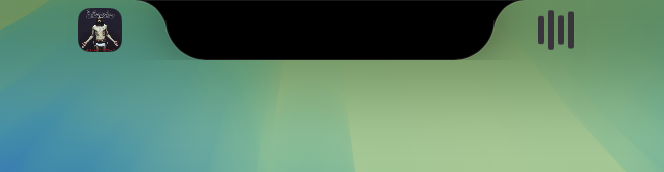

# LiquidNotch

LiquidNotch is a dynamic utility for macOS that transforms the notch area into a functional hub. It offers seamless media controls, a music visualizer, and a convenient file drop zone, all integrated into a sleek, unobtrusive interface.

## Features

-   **Dynamic Notch Interaction**: Expands when hovered or when media is playing.
-   **Media Controls**: Play, pause, skip tracks, and view album art directly from the notch area.
-   **Music Visualizer**: A live audio visualizer that reacts to your music.
-   **File Drop Zone**: Drag and drop files to the notch for quick temporary storage or actions.
-   **Native Look & Feel**: Designed to blend perfectly with macOS aesthetics.

## Screenshots



*Music Player & Visualizer*


*File Drop Interaction*


## Prerequisites

-   macOS 13.0 or later.
-   Swift 5.9 or later.

## Installation

### From Source

1.  **Clone the repository:**
    ```bash
    git clone https://github.com/yourusername/LiquidNotch.git
    cd LiquidNotch
    ```

2.  **Build the application:**
    You can use the provided `Makefile` to build and package the app.
    ```bash
    make
    ```
    This command will Compile the Swift code and create `LiquidNotch.app`.

3.  **Run the application:**
    Open the generated `LiquidNotch.app` or move it to your Applications folder.

### Manual Build (Swift Package Manager)

If you prefer using SwiftPM directly:

```bash
swift build -c release
```

## Usage

1.  Launch **LiquidNotch**.
2.  Move your mouse pointer to the top of the screen (notch area) to reveal the interface.
3.  **Music**: Play music in a supported player (like Apple Music) to see track info and visualizer.
4.  **Drag & Drop**: Drag a file to the notch area to "hold" it.

## Contributing

Contributions are welcome! Please feel free to submit a Pull Request.

## License

[MIT License](LICENSE)
